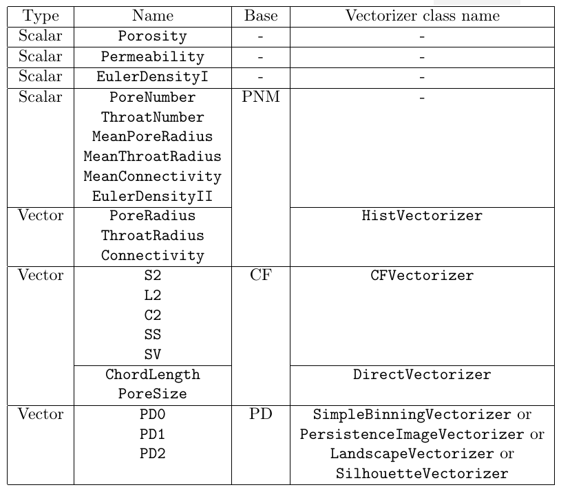
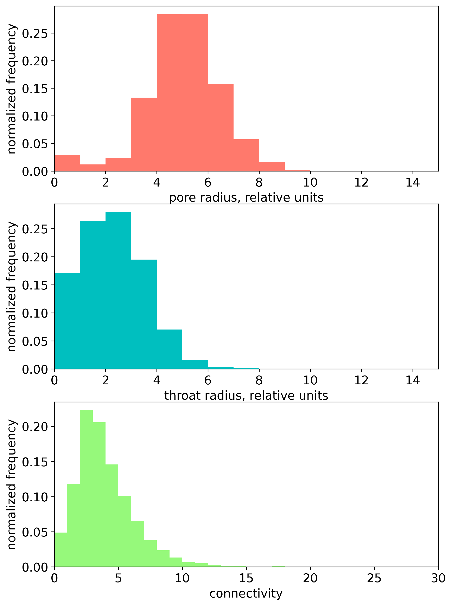
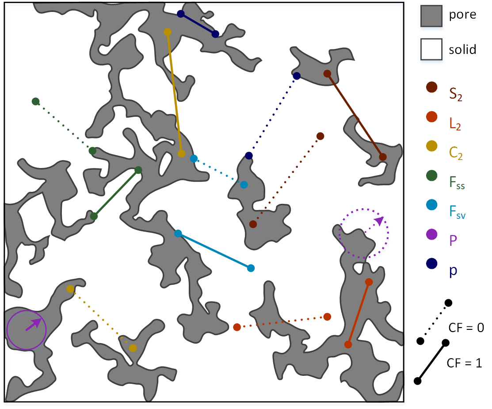
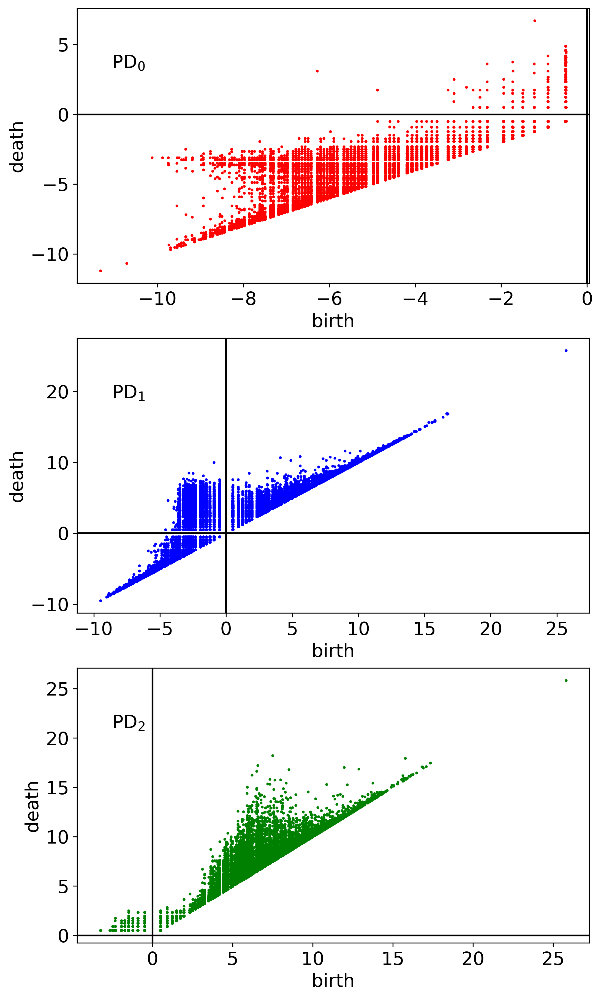

.. _metrics:

Metrics
==================

.. toctree::
   :maxdepth: 2

One can perform REV analysis for 22 metrics, implemented using corresponding classes. The summary of their properties is presented at the table below:

   
Let us briefly desribe these metrics.

Porosity
----------
Porosity, the scalar metric, is computed internally by counting the number of pore voxels with subsequent normalization over the total number of voxels in the considered volume.

This metric is implemented using :doc:`class Porosity. <../_autosummary/revanalyzer.metrics.porosity.Porosity>`

Permeability
------------
In order to compute permeability (:doc:`class Permeability <../_autosummary/revanalyzer.metrics.permeability.Permeability>`), we use the Python wrapper of C++ FDMSS solver,
the external solver of Stokes’s equation with 4th order spatial accuracy scheme (Gerke, K. M., Vasilyev, R. V., Khirevich, S., Collins, D., Karsanina, M. V., Sizonenko, T. O., ... & Mallants, D. (2018). Finite-difference method Stokes solver (FDMSS) for 3D pore geometries: Software development, validation and case studies. Computers & geosciences, 114, 41-58).

Euler density
-------------
Euler density, the scalar metric, describing the topological properties of 3D image, is computed by the normalization of Euler number :math:`\chi`  over the total number of voxels in the considered volume.
One can use its correct (:doc:`class EulerDensityI <../_autosummary/revanalyzer.metrics.euler_density_i.EulerDensityI>`) and approximate (:doc:`class EulerDensityII <../_autosummary/revanalyzer.metrics.pnm.EulerDensityII>`) values.

The correct Euler number for a given voxel domain can be calculated using the following expression (Vogel, H. J., Weller, U., & Schlüter, S. (2010). Quantification of soil structure based on Minkowski functions. Computers & Geosciences, 36(10), 1236-1245):

.. math::

   \chi = \# vertices - \# edges + \# faces - \# volumes,
   
where :math:`\#` means 'number of'. The correct Euler densities are computed using julia library EulerCharacteristic.jl.

One can also use the approximate expression for Euler number using the characteristics of pore-network model (PNM), extracted from 3D image (see the next subsection):

.. math::

   \chi \approx N_p - N_t,
   
where :math:`N_p` and :math:`N_t` are pores and throat numbers given by PNM.

PNM characteristics
-------------------
Pore-network models (PNM) divide the void space of the 3D image into pores representing wider regions that are connected through narrower restrictions called throats. 
Coonectivity (also called coordination number) for a single pore is defined as the number of thoats, connecting the given pore with the other ones.

Here, we consider 6 scalar PNM-based metrics:

	* pore number (:doc:`class PoreNumber <../_autosummary/revanalyzer.metrics.pnm.PoreNumber>`),
	* throat number (:doc:`class ThroatNumber <../_autosummary/revanalyzer.metrics.pnm.ThroatNumber>`),
	* mean pore radius (:doc:`class MeanPoreRadius <../_autosummary/revanalyzer.metrics.pnm.MeanPoreRadius>`),
	* mean throat radius (:doc:`class MeanThroatRadius <../_autosummary/revanalyzer.metrics.pnm.MeanThroatRadius>`),
	* mean connectivity (:doc:`class MeanConnectivity <../_autosummary/revanalyzer.metrics.pnm.MeanConnectivity>`),
	* approximate Euler density (:doc:`class EulerDensityII <../_autosummary/revanalyzer.metrics.pnm.EulerDensityII>`, also see the previous subsection).

We also consider 3 vector PNM-based metrics:

	* pore radius (:doc:`class PoreRadius <../_autosummary/revanalyzer.metrics.pnm.PoreRadius>`),
	* throat radius (:doc:`class ThroatRadius <../_autosummary/revanalyzer.metrics.pnm.ThroatRadius>`), 
	* connectivity (:doc:`class Connectivity <../_autosummary/revanalyzer.metrics.pnm.Connectivity>`).

Pore, throat radii and connectivities can be presented as 1d histograms (see the figure below). These histograms can be vectorized using histogram vectorizer (:doc:`class HistVectorizer <../_autosummary/revanalyzer.vectorizers.hist_vectorizer.HistVectorizer>`).

Correlation functions
---------------------
We consider 5 types of directional correlation functions (CFs): 

	* two-point probability function :math:`S_2(\boldsymbol{r})` (:doc:`class S2 <../_autosummary/revanalyzer.metrics.cf.S2>`),
	* lineal function :math:`L_2(\boldsymbol{r})` (:doc:`class L2 <../_autosummary/revanalyzer.metrics.cf.L2>`),
	* cluster function :math:`C_2(\boldsymbol{r})` (:doc:`class C2 <../_autosummary/revanalyzer.metrics.cf.C2>`), 
	* surface-surface function :math:`F_{SS}(\boldsymbol{r})` (:doc:`class SS <../_autosummary/revanalyzer.metrics.cf.SS>`),
	* surface-void function :math:`F_{SV}(\boldsymbol{r})` (:doc:`class SV <../_autosummary/revanalyzer.metrics.cf.SV>`).
	
Each correlation function measures a probability of some event for a given correlation length :math:`\boldsymbol{r}`. Specifically, :math:`S_2(\boldsymbol{r})` measures the probability that both ends of the :math:`\boldsymbol{r}` line segment lie within pore phase, 
:math:`L_2(\boldsymbol{r})` — the probability that the whole segment lies within the pore space, :math:`C_2(\boldsymbol{r})` — that both ends of the segment lie within the same pore cluster, 
:math:`F_{SS}(\boldsymbol{r})` — that both ends fall into a pore-solid interface, :math:`F_{SV}(\boldsymbol{r})` - that one end lies in a pore-solid interface and the other one lies within the pore volume. The correlation length :math:`\boldsymbol{r}` was chosen to vary from 0 to a half of total linear size (in voxels) of the studied sample. 
These CFs ara computed along three major orthogonal directions :math:`x`, :math:`y` and :math:`z`. 

We also consider two types of probability density CFs:

	* chord length function :math:`p(r)` (:doc:`class ChordLength <../_autosummary/revanalyzer.metrics.cf.ChordLength>`),
	* pore size function :math:`P(r)` (:doc:`class PoreSize <../_autosummary/revanalyzer.metrics.cf.PoreSize>`),

CF :math:`p(r)` measures the probability of finding a chord of length between :math:`r` and :math:`r+dr` in pore phase. Chord is a line segment which lies entirely in the same phase and touches the interface with its ends. CF :math:`P(r)` measures the probability that a randomly chosen point in a set of points belonging to the void phase lies at a distance between :math:`r` and :math:`r+dr` from the nearest point on the pore-solid interface.

Any additional details on different CFs can be found in comprehensive Torquato’s book (Torquato S. (2002) Random Heterogeneous Materials: Microstructure and Macroscopic Properties (SpringerVerlag, New York).

Graphical explanation in addition to definitions above is presented in the figure below.

  
All CFs are computed using julia library CorrelationFunctions.jl (Postnicov, V., Samarin, A., Karsanina, M. V., Gravey, M., Khlyupin, A., & Gerke, K. M. (2024). Evaluation of classical correlation functions from 2/3D images on CPU and GPU architectures: Introducing CorrelationFunctions. jl. Computer Physics Communications, 299, 109134).

The directional and probability density CFs are vectorized using CF vectorizer (:doc:`class CFVectorizer <../_autosummary/revanalyzer.vectorizers.cf_vectorizer.CFVectorizer>`) and Direct Vectorizer (:doc:`class DirectVectorizer <../_autosummary/revanalyzer.vectorizers.direct_vectorizer.DirectVectorizer>`), respectively.

Persistence diagrams
--------------------
Persistence diagram (PD) is 2D visualization of persistent homology analysis applied to some 3D domain. PDs provide the scales of topological features and clarify the geometric relationships among them.
The total set of persistent pairs located in 2D coordinate plane form a persistence diagram :math:`\mathrm{PD}_k`. We condider 3 PD-based vector metrics:

	* :math:`\mathrm{PD}_0` (:doc:`class PD0 <../_autosummary/revanalyzer.metrics.pd.PD0>`),
	* :math:`\mathrm{PD}_1` (:doc:`class PD1 <../_autosummary/revanalyzer.metrics.pd.PD1>`),
	* :math:`\mathrm{PD}_2` (:doc:`class PD2 <../_autosummary/revanalyzer.metrics.pd.PD2>`).

:math:`\mathrm{PD}_0` represents the births and deaths of connected components, :math:`\mathrm{PD}_1` — the births and deaths of 1-cycles (rings), and :math:`\mathrm{PD}_2` — the births and deaths of 2-cycles (cavities).
The example of computed PDs are presented at the figure below.

In our library PDs are generated using the python wrapper of C++ library Diamorse (https://github.com/AppliedMathematicsANU/diamorse). 

The generated PD data can be vectorized using 4 different vectorization methods (vectorizers):

	* simple binning (:doc:`class SimpleBinningVectorizer <../_autosummary/revanalyzer.vectorizers.simple_binning_vectorizer.SimpleBinningVectorizer>`),
	* persistence image (:doc:`class PersistenceImageVectorizer <../_autosummary/revanalyzer.vectorizers.persistence_image_vectorizer.PersistenceImageVectorizer>`),
	* landscape (:doc:`class LandscapeVectorizer <../_autosummary/revanalyzer.vectorizers.landscape_vectorizer>`),
	* silhouette (:doc:`class SilhouetteVectorizer <../_autosummary/revanalyzer.vectorizers.silhouette_vectorizer.SilhouetteVectorizer>`).
	
For the details of these vectorization methods see Supplementary Materials in (Zubov, A. S., Khlyupin, A. N., Karsanina, M. V., & Gerke, K. M. (2024). In search for representative elementary volume (REV) within heterogeneous materials: A survey of scalar and vector metrics using porous media as an example. Advances in Water Resources, 192, 104762).
