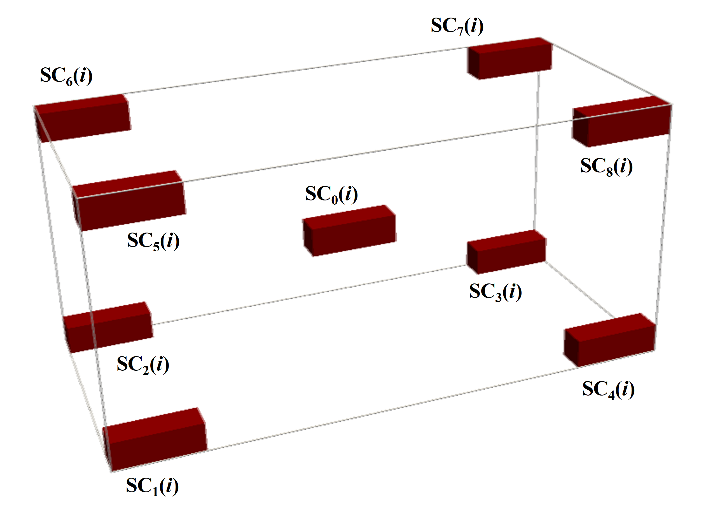

.. _theory:

Theoretical background
======================

.. toctree::
   :maxdepth: 2

Here, we present a short theoretical introduction to the representativity analysis of binary images.

REV concept. 
------------

**Representative Elemental Volume (REV)** concept is a useful characteristic of the system heterogeneity. 
By definition, REV is the smallest volume in which large fluctuations of observed quantities or calculated metric no longer occur. 
So, subdomains with volumes larger than REV can be treated as homogenous.

The common technique for some metric REV analysis is cutting subsamples of growing sizes from a given sample and comparison of the studied metric values for them.
One can perform REV analysis for a scalar metric :math:`S` by checking if the values of :math:`S` converge to a stable value with an increasing subsample volume of the studied sample. 
Two criteria can be applied for the estimation of such a convergence:

	* - the difference in values of :math:`S` for subsamples of different sizes becomes negligible (I);
	* - the deviations of :math:`S` for subsamples of fixed size becomes negligible (II).
	
We call REV obtained using criteria (I) and (II) **deterministic (dREV)** and **statistical (sREV)**, respectively.

For a vector metric :math:`\boldsymbol{V}` the same criteria can be used as well, with the substitution of the *difference in scalar values* by the *distance between vectors*. 

Subsamples selection.
---------------------

At *i*-th selection step subsamples for REV analysis SC :math:`_k(i)` are taken as it is shawn in the figure above. Total number of selection steps :math:`N` is input parameter for computations.

The reliable sREV analysis is possible only if subsamples do not overlap or their overlap is limited. Therefore, we introduce the :math:`N_{sREV}` parameter. For :math:`i \le N_{sREV}`, we cut from the considered sample all 9 subsamples SC :math:`_k(i)`. For :math:`i > N_{sREV}`, only the center subsamples SC :math:`_0(i)` are cut. 

REV size estimation. Scalar metric. 
-----------------------------------

For the estimation of sREV size for scalar metric :math:`S`, we first calculate its values :math:`S_{ik}` for the subsamples SC :math:`_k(i)`, and then obtain mean value 
:math:`\bar{S_i}`, standard deviation :math:`\sigma_i` and, finally, use the following formula:

.. math::

    m: \forall i \ge m, \quad \sigma_{norm}(i) = \sigma_i/ \bar{S_i} < \varepsilon_{sREV},  \quad  (1)

where :math:`\varepsilon_{sREV}` is sREV threshold. The value, obtained using Eq. (1), is assigned to the attribute sREV_size_1 of an PARSE object in the case of scalar metric REV analysis.

For the estimation of dREV size we use two different formulas:

.. math::

    m: \forall i \ge m, \quad \delta_1(i) = |2(\bar{S_i} - \bar{S}_{i+1})/(\bar{S_i} + \bar{S}_{i+1})| < \varepsilon_{dREV} \quad (2)
    
and

.. math::

    m: \forall i \ge m,  \quad \delta_2(i) = |2(\bar{S_i} - S_0)/(\bar{S_i} + S_0)| < \varepsilon_{dREV}, \quad (3)

where :math:`S_0` is the metirc value for the uncut analyzed image and :math:`\varepsilon_{dREV}` is dREV threshold.
The values, obtained using Eqs. (2) and (3), are assigned, respectively, to the attributes dREV_size_1 and dREV_size_2 of an PARSE object in the case of scalar metric REV analysis. 

REV size estimation. Vector metric. 
-----------------------------------

One can apply the methods for REV size estimation for scalar metric :math:`S` described above to the vector metric :math:`\boldsymbol{V}`, using some adjustments. 
Let some descriptor :math:`D_i` defined at :math:`i`-th subcube is vectorized into the vector :math:`\boldsymbol{V_i}(N_{\textrm{bins}}(i), s(i), r(i))`,  where number of bins :math:`N_{\textrm{bins}}(i)`, bin size :math:`s(i)` and range :math:`r(i)` are vectorization parameters. We fix bin size equal for all the subcubes: :math:`s(i)` = const, and require that vector :math:`\boldsymbol{V_{i+1}}` obtained from :math:`D` at the next increment step should have the same dimension (equal to number of bins) and range, as :math:`\boldsymbol{V_i}`.  
If ranges :math:`r(i)` and :math:`r(i+1)` coincide, this condition is satisfied automatically, in opposite case, vector :math:`\boldsymbol{V_{i+1}}` is modified to the vector :math:`\boldsymbol{V*_{i+1}}` as the following: bins, present in :math:`r(i)`  but absent in :math:`r(i+1)` are added to :math:`\boldsymbol{V_{i+1}}` and filled by zeroes, bins absent in :math:`r(i)`  but present in :math:`r(i+1)` are removed from :math:`\boldsymbol{V_{i+1}}` (see figure below). 

.. image:: images/fig_scheme.png
    :align: center
    
At each selection step :math:`i` we take subsamples SC :math:`_k(i)` and SC :math:`_l(i+1)` and compute the normalized distance between the vectors :math:`\boldsymbol{V_{l(i+1)}}` and :math:`\boldsymbol{V_{ki}}`:

.. math::

    \delta(i,k,l) = 2 \frac{||\boldsymbol{V^*_{l(i+1)}} - \boldsymbol{V_{ki}||}}{||\boldsymbol{V^*_{l(i+1)}}||+||\boldsymbol{V_{ki}}||}. \quad (4)

Order of the vector norm :math:`||\boldsymbol{V}||` is the input parameter of any vectorizer used in PARSE library.

For the estimation of dREV and sREV sizes for vector metric, fist we calculate mean values :math:`\bar{\delta}(i)` over all pairs of indices (:math:`k`, :math:`l`), its standard deviation :math:`\sigma_i` and normalized standard deviation  :math:`\sigma_{norm}(i) = \sigma_i/ \bar{\delta}(i)`.

Then for the estimation of dREV size we use the following formula:

.. math::

    m: \forall i \ge m, \quad \bar{\delta}(i) < \varepsilon_{dREV}, \quad (5)
    
where :math:`\varepsilon_{dREV}` is dREV threshold. The value, obtained using Eq. (5), is assigned to the attribute dREV_size_1 of an PARSE object in the case of vector metric REV analysis.

For the estimation of sREV size we use two following formulas:

.. math::

    m: \forall i \ge m, \quad  \sigma_{norm1}(i) = \sigma_i/ \varepsilon_{dREV} < \varepsilon_{sREV}  \quad  (6)
    
and 

.. math::

    m: \forall i \ge m,  \quad  \sigma_{norm2}(i) = \sigma_i/ D(i) < \varepsilon_{sREV}, \quad  (7)

where :math:`D(i) = \varepsilon_{dREV}`, if :math:`\bar{\delta}(i) < \varepsilon_{dREV}` and :math:`D(i) = \bar{\delta}(i)` if
:math:`\bar{\delta}(i) \ge \varepsilon_{dREV}`; :math:`\varepsilon_{sREV}` is sREV threshold. The values, obtained using Eqs. (6) and (7), are assigned, respectively, to the attributes sREV_size_1 and sREV_size_2 of an PARSE object in the case of scalar metric REV analysis. 

Image comparison. 
-----------------

To compare image samples :math:`A` and :math:`B` using descriptor :math:`D` susceptible to vectorization one can make modification as decribed above and calculate the distance value:

.. math::

    \delta_{AB} = 2 \frac{||\boldsymbol{V_A} - \boldsymbol{V^*_B}||}{||\boldsymbol{V_A}||+||\boldsymbol{V^*_B}||}. \quad (8) 
    

If Euclidean norm is selected, one can also use cosine similarity to compare samples :math:`A` and :math:`B`:

.. math::

     \mathrm{Sc}_{AB} = \frac{(\boldsymbol{V_A}  \cdot \boldsymbol{V^*_B})}{||\boldsymbol{V_A}||||\boldsymbol{V^*_B}||}. \quad (9)

Stationarity analysis. 
----------------------

We propose the following empirical stationarity criterion in our library. For all :math:`i = 1, ..\le N_{sREV}-1` and :math:`k,l = 0,..8` we compute the values

.. math::

    \delta^{st}_1(i,k,l) = 2 \frac{||\boldsymbol{V_{ik}} - \boldsymbol{V_{il}}||}{||\boldsymbol{V_{ik}}||+||\boldsymbol{V_{il}}||} \quad (10)

and

.. math::

    \delta^{st}_2(i,k) = 2 \frac{||\boldsymbol{V_{ik}} - \boldsymbol{V^*_{(i+1)k}}||}{||\boldsymbol{V_{ik}}||+||\boldsymbol{V^*_{(i+1)k}}||}. \quad (11) 
    
Then we check out the satisfaction of following condition:

.. math::

    \forall i \ge N_{sREV}-1, \quad  \max_{(k,l)} \delta^{st}_1(i,k,l) < \varepsilon_{st} \quad \textrm{and} \quad  \max_{k} \delta^{st}_2(i,k) <   \varepsilon_{st}. \quad (12) 
    
Here, :math:`\varepsilon_{st}` is stationarity threshold.
