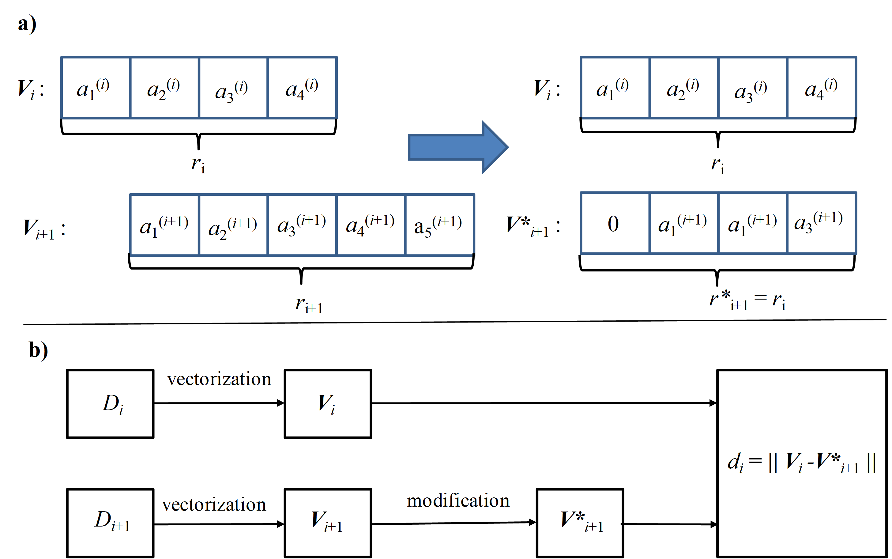

.. _theory:

REV analysis
============

.. toctree::
   :maxdepth: 2

Here, we present a short theoretical introduction to the representativity analysis of binary images.

REV concept 
-----------

**Representative Elemental Volume (REV)** concept is a useful characteristic of the system heterogeneity. 
By definition, REV is the smallest volume in which large fluctuations of observed quantities or calculated metric no longer occur. 
So, subdomains with volumes larger than REV can be treated as homogenous.

The common technique for some metric REV analysis is cutting subsamples of growing sizes from a given sample and comparison of the studied metric values for them.
One can perform REV analysis for a scalar metric :math:`S` by checking if the values of :math:`S` converge to a stable value with an increasing subsample volume of the studied sample. 
Two criteria can be applied for the estimation of such a convergence:

	* - the difference in values of :math:`S` for subsamples of different sizes becomes negligible (I);
	* - the deviations of :math:`S` for subsamples of fixed size becomes negligible (II).
	
We call REV obtained using criteria (I) and (II) **deterministic (dREV)** and **statistical (sREV)**, respectively.

For a vector metric :math:`\boldsymbol{V}` the same criteria can be used as well, with the substitution of the *difference in scalar values* by the *distance between vectors*. 

REV size estimation. Scalar metric. 
-----------------------------------

Subsamples for REV analysis form a set of growing subcubes SC :math:`_k(i)` with linear size  :math:`L_i = L_0 + i \Delta L`, here :math:`\Delta L` is the increment step and 
:math:`L_0 =  \Delta L`. 

For the estimation of sREV size for scalar metric :math:`S`, we first calculate its values :math:`S_{ik}` for the subcubes SC :math:`_k(i)`, and then obtain mean value 
:math:`\bar{S_i}`, standard deviation :math:`\sigma_i` and, finally, use the following formula:

.. math::

    m: \forall i \ge m, \quad \sigma_{norm}(i) = \sigma_i/ \bar{S_i} < \varepsilon_{sREV},  \quad  (1)

where :math:`\varepsilon_{sREV}` is sREV threshold. The value, obtained using Eq. (1), is assigned to the attribute sREV_size_1 of an REVAnalyzer object in the case of scalar metric REV analysis.

For the estimation of dREV size we use two different formulas:

.. math::

    m: \forall i \ge m, \quad \delta_1(i) = |2(\bar{S_i} - \bar{S}_{i+1})/(\bar{S_i} + \bar{S}_{i+1})| < \varepsilon_{dREV} \quad (2)
    
and

.. math::

    m: \forall i \ge m,  \quad \delta_2(i) = |2(\bar{S_i} - S_0)/(\bar{S_i} + S_0)| < \varepsilon_{dREV}, \quad (3)

where :math:`S_0` is the metirc value for the uncut analyzed image and :math:`\varepsilon_{dREV}` is dREV threshold.
The values, obtained using Eqs. (2) and (3), are assigned, respectively, to the attributes dREV_size_1 and dREV_size_2 of an REVAnalyzer object in the case of scalar metric REV analysis. 

REV size estimation. Vector metric. 
-----------------------------------

One can apply the methods for REV size estimation for scalar metric :math:`S` described above to the vector metric :math:`\boldsymbol{V}`, using some adjustments. 
Let some descriptor :math:`D_i` defined at :math:`i`-th subcube is vectorized into the vector :math:`\boldsymbol{V_i}(N_{\textrm{bins}}(i), s(i), r(i))`,  where number of bins :math:`N_{\textrm{bins}}(i)`, bin size :math:`s(i)` and range :math:`r(i)` are vectorization parameters. We fix bin size equal for all the subcubes: :math:`s(i)` = const, and require that vector :math:`\boldsymbol{V_{i+1}}` obtained from :math:`D` at the next increment step should have the same dimension (equal to number of bins) and range, as :math:`\boldsymbol{V_i}`.  
If ranges :math:`r(i)` and :math:`r(i+1)` coincide, this condition is satisfied automatically, in opposite case, vector :math:`\boldsymbol{V_{i+1}}` is modified to the vector :math:`\boldsymbol{V*_{i+1}}` as the following: bins, present in :math:`r(i)`  but absent in :math:`r(i+1)` are added to :math:`\boldsymbol{V_{i+1}}` and filled by zeroes, bins absent in :math:`r(i)`  but present in :math:`r(i+1)` are removed from :math:`\boldsymbol{V_{i+1}}` (see Fig. 1). 

    
**Fig. 1.** a) Modification of the vectorized descriptor D to prepare it for the REV analysis; b) the overall scheme of the comparison based on vector metrics.

At each cut step :math:`i`  we take subcubes SC :math:`_k(i)` and SC :math:`_l(i+1)` and compute the normalized distance between the vectors :math:`\boldsymbol{V_{l(i+1)}}` and :math:`\boldsymbol{V_{ki}}`:

.. math::

    \delta(i,k,l) = 2 \frac{||\boldsymbol{V^*_{l(i+1)}} - \boldsymbol{V_{ki}||}}{||\boldsymbol{V^*_{l(i+1)}}||+||\boldsymbol{V_{ki}}||}. \quad (4)

Order of the vector norm :math:`||\boldsymbol{V}||` is the input parameter of any vectorizer used in REVAnalyzer library.

For the estimation of dREV and sREV sizes for vector metric, fist we calculate mean values :math:`\bar{\delta}(i)` over all pairs of indices (:math:`k`, :math:`l`), its standard deviation :math:`\sigma_i` and normalized standard deviation  :math:`\sigma_{norm}(i) = \sigma_i/ \bar{\delta}(i)`.

Then for the estimation of dREV size we use the following formula:

.. math::

    m: \forall i \ge m, \quad \bar{\delta}(i) < \varepsilon_{dREV}, \quad (5)
    
where :math:`\varepsilon_{dREV}` is dREV threshold. The value, obtained using Eq. (5), is assigned to the attribute dREV_size_1 of an REVAnalyzer object in the case of vector metric REV analysis.

For the estimation of sREV size we use two following formulas:

.. math::

    m: \forall i \ge m, \quad  \sigma_{norm1}(i) = \sigma_i/ \varepsilon_{dREV} < \varepsilon_{sREV}  \quad  (6)
    
and 

.. math::

    m: \forall i \ge m,  \quad  \sigma_{norm2}(i) = \sigma_i/ D(i) < \varepsilon_{sREV}, \quad  (7)

where :math:`D(i) = \varepsilon_{dREV}`, if :math:`\bar{\delta}(i) < \varepsilon_{dREV}` and :math:`D(i) = \bar{\delta}(i)` if
:math:`\bar{\delta}(i) \ge \varepsilon_{dREV}`; :math:`\varepsilon_{sREV}` is sREV threshold. The values, obtained using Eqs. (6) and (7), are assigned, respectively, to the attributes sREV_size_1 and sREV_size_2 of an REVAnalyzer object in the case of scalar metric REV analysis. 

